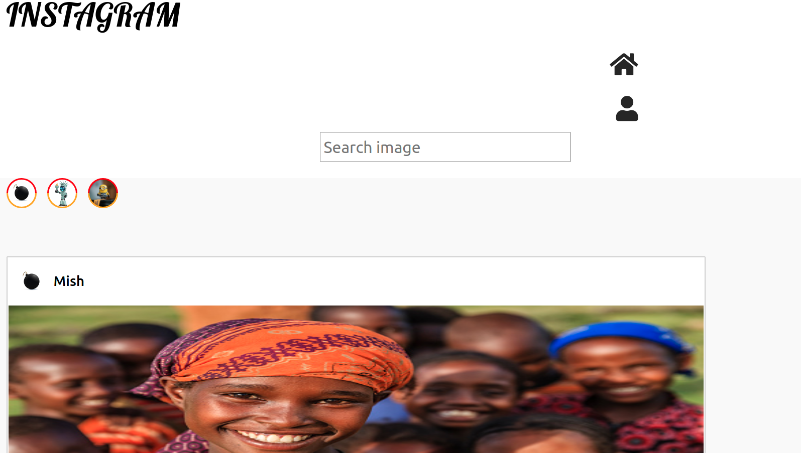

## Instagram Clone Web Application
This is an Instagram Clone Web Application where the user can signup for an account, add posts, like posts and comment on posts. 

## screenshot-images

## Author
ONYANGO ANIPHER CHELSEA
## Built With
Python3.8

Django3.2.8

Bootstrap5

CSS

## Prerequisites
Create and activate Virtual env then install pip
To install django -pip install django LTS
Have basic git knowledge

## Installation
Clone the repository

git clone https://github.com/chelseaayoo/Instagram-app

Install the latest django version and other requirements in my requirements.txt file

Usage
The user will register for an account will be logged in then he/she  can post,like and comment.

Contributing
Any contributions you make are greatly appreciated.

If you have a suggestion that would make this better, please fork the repo and create a pull request.

Fork the Project
Create your Feature Branch (git checkout -b contribution)
Commit your Changes (git commit -m 'Add contribution')
Push to the Branch (git push origin contribution)
Open a Pull Request
## Contact Information
E_MAIL : chelsea.ayoo@student.moringaschool.com

Project Link: https://github.com/chelseaayoo/Instagram-app

## License
MIT License Copyright (c) [2021] [ONYANGO ANIPHER CHELSEA AYOO]

Permission is hereby granted, free of charge, to any person obtaining a copy of this software and associated documentation files (the "Software"), to deal in the Software without restriction, including without limitation the rights to use, copy, modify, merge, publish, distribute, sublicense, and/or sell copies of the Software, and to permit persons to whom the Software is furnished to do so, subject to the following conditions:

The above copyright notice and this permission notice shall be included in all copies or substantial portions of the Software.

THE SOFTWARE IS PROVIDED "AS IS", WITHOUT WARRANTY OF ANY KIND, EXPRESS OR IMPLIED, INCLUDING BUT NOT LIMITED TO THE WARRANTIES OF MERCHANTABILITY, FITNESS FOR A PARTICULAR PURPOSE AND NONINFRINGEMENT. IN NO EVENT SHALL THE AUTHORS OR COPYRIGHT HOLDERS BE LIABLE FOR ANY CLAIM, DAMAGES OR OTHER LIABILITY, WHETHER IN AN ACTION OF CONTRACT, TORT OR OTHERWISE, ARISING FROM, OUT OF OR IN CONNECTION WITH THE SOFTWARE OR THE USE OR OTHER DEALINGS IN THE SOFTWARE. Copyright (c) {2021} {ONYANGO ANIPHER CHELSEA AYOO}

## Copyright
Copyright (c) {2021} ONYANGO ANIPHER CHELSEA
